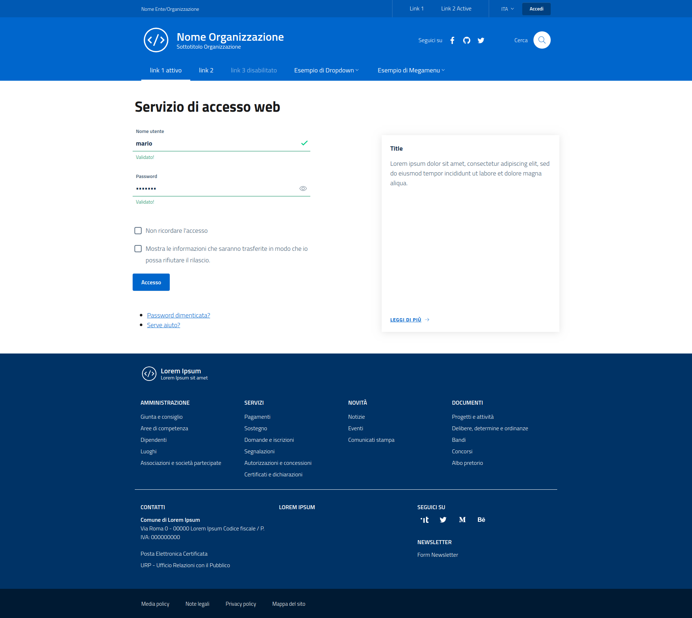
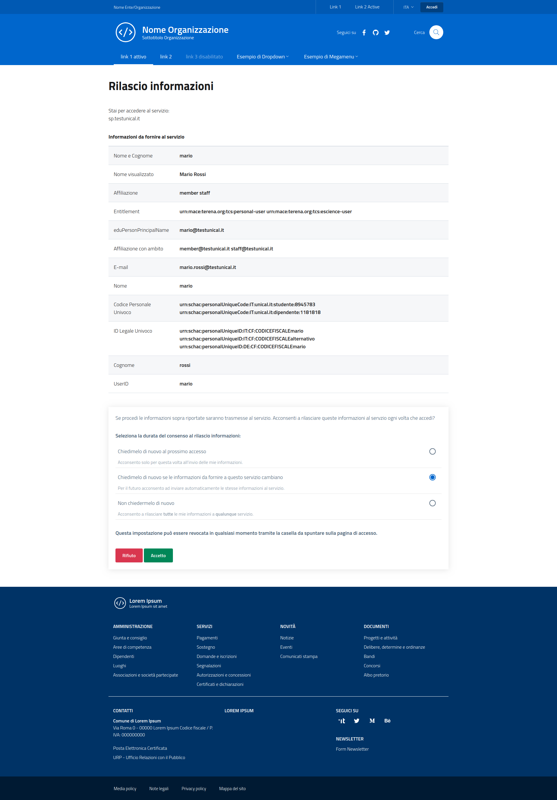

##design-shibboleth-idp-theme

Bootstrap Italia template for Shibboleth IdP > 3.2
--------------------------------------------------

Completamente open-source, costruita sulle fondamenta di [Bootstrap Italia v1.3.7](https://italia.github.io/bootstrap-italia/),
di cui eredita tutte le funzionalità, componenti, griglie e classi di utilità,
secondo le [Linee Guida di Design per i siti web della Pubblica Amministrazione](https://docs.italia.it/italia/designers-italia/design-linee-guida-docs/it/stabile/).
**Bootstrap Italia** usa i pattern e i componenti definiti nello [UI Kit](https://designers.italia.it/kit/ui-kit/)
di Designers Italia e li trasforma in codice già pronto all'uso.

Questa libreria per un Identity Provider (IdP) Shibboleth (ver. > 3.2) fornisce lo schema di default
del template al fine di dotare il proprio progetto di una interfaccia grafica che rispetti
le Linee guida di design per i servizi web della Pubblica Amministrazione.

[QUI](https://italia.github.io/bootstrap-italia/docs/come-iniziare/introduzione/)
è possibile prendere visione del codice sorgente per l'implementazione di tutti
i componenti grafici messi a disposizione.

Installazione
-------------

Considerando *idp.home* come path di installazione di *shibboleth-idp*

- Copiare le cartelle ```edit-webapp``` (file statici) e ```views``` (template) in ```idp.home```
- Effettuare il rebuild del file WAR tramite linea di comando (```idp.home/bin/build.sh``` o ```idp.home\bin\build.bat```)
- Riavviare il web server

Galleria
--------


_Login_


_Agreement_
