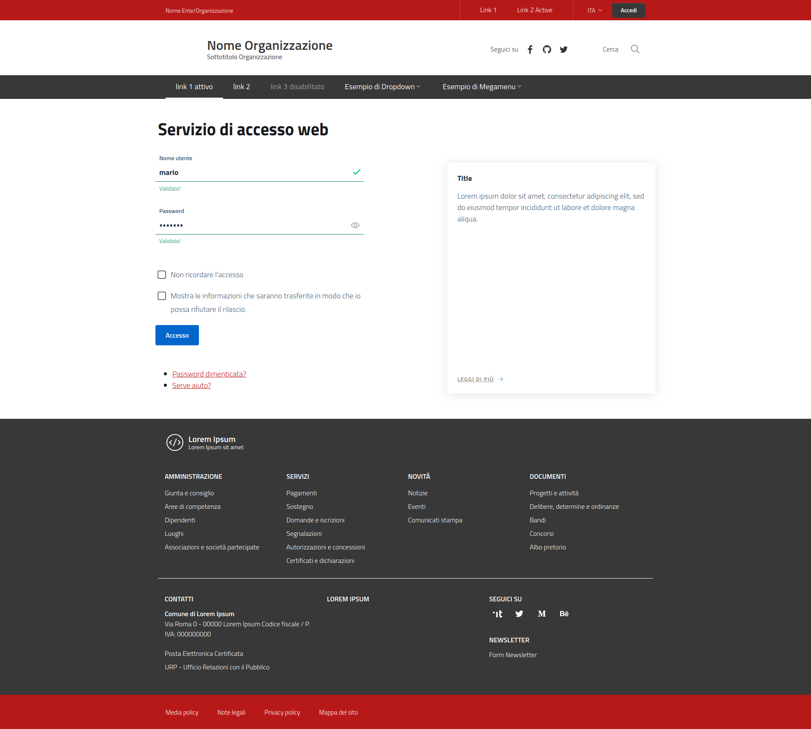

## design-shibboleth-idp-theme

Bootstrap Italia template for Shibboleth IdP > 3.2
--------------------------------------------------

Template css/html per Shibboleth Identity Provider (IdP ver. > 3.2) costruito al di sopra di [Bootstrap Italia v1.3.7](https://italia.github.io/bootstrap-italia/).

Questo progetto eredita tutte le funzionalità, componenti, griglie e classi di utilità definite nelle [Linee Guida di Design per i siti web della Pubblica Amministrazione](https://docs.italia.it/italia/designers-italia/design-linee-guida-docs/it/stabile/), mediante i pattern e i componenti definiti nello [UI Kit](https://designers.italia.it/kit/ui-kit/)
di Designers Italia.

[QUI](https://italia.github.io/bootstrap-italia/docs/come-iniziare/introduzione/)
è possibile prendere visione del codice sorgente per l'implementazione di tutti
i componenti grafici messi a disposizione.

Installazione
-------------

Considerando `idp.home` (solitamente /opt/shibboleth-idp) come path di installazione di *shibboleth-idp*, seguire i seguenti passaggi:

- Copiare le cartelle ```edit-webapp``` (file statici) e ```views``` (template) in ```idp.home```;
- Effettuare il rebuild del file WAR tramite linea di comando (```idp.home/bin/build.sh``` o ```idp.home\bin\build.bat```);
- Riavviare il web server (tomcat, jetty o altro servlet container).

Personalizzazione
-----------------

E' possibile personalizzare il template di base adeguandolo allo stile della propria organizzazione.

Esempio (stile per l'Università della Calabria):

- In ```edit-webapp``` è presente la cartella ```unical-style```
- Includere ```<link rel="stylesheet" href="$request.getContextPath()/unical-style/css/unical-style.css">``` a valle dei fogli di stile
- Effettuare il rebuild del file WAR tramite linea di comando (```idp.home/bin/build.sh``` o ```idp.home\bin\build.bat```);
- Riavviare il web server (tomcat, jetty o altro servlet container).

Galleria
--------


_Login_


_Agreement_


_Custom Login_
